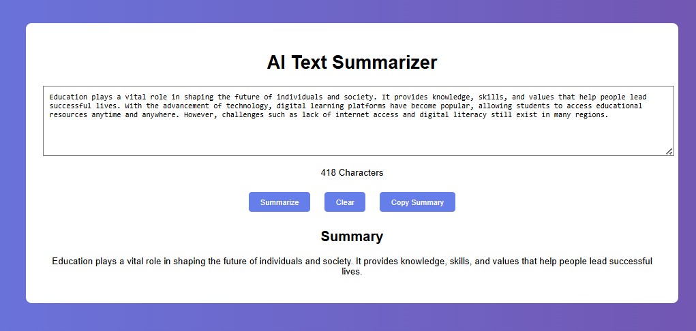
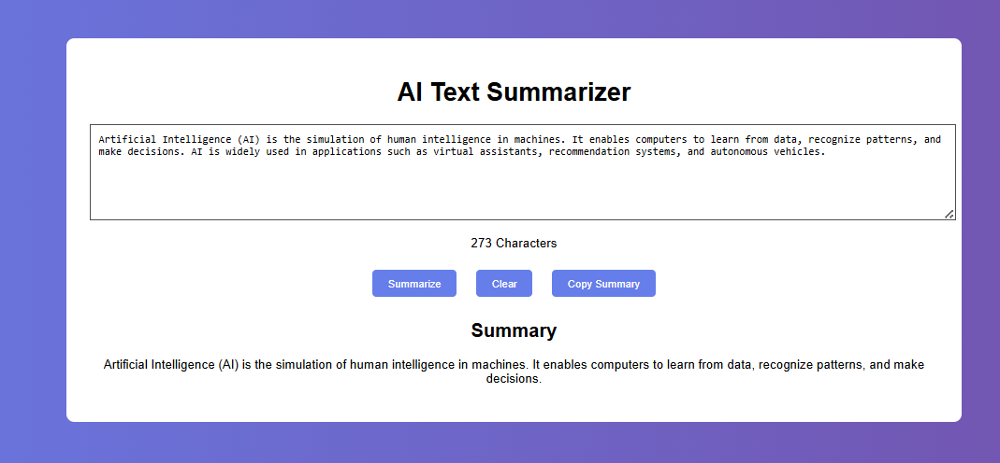

🤖 AI Text Summarizer
📌 Project Description

The AI Text Summarizer is a web application that converts long text into a short and meaningful summary using Natural Language Processing (NLP).

This project helps users quickly understand large content by generating concise summaries.

🚀 Features

✨ Summarizes long text into short content

📊 Character count display

📋 Copy summary to clipboard

🧹 Clear input text easily

🌐 Simple and user-friendly interface

🛠️ Technologies Used

Frontend: HTML, CSS, JavaScript

Backend: Python (Flask)

Library: Transformers (Hugging Face)

▶️ How to Run the Project
Step 1: Clone Repository
git clone https://github.com/ajaygoud16/CodeAlpha_AI_Text_Summarizer.git
cd CodeAlpha_AI_Text_Summarizer

Step 2: Install Requirements
pip install -r requirements.txt

Step 3: Run the Application
python app.py

Step 4: Open in Browser
 http://127.0.0.1:5000 

👉📷 Output Screenshots

🌍 Live Demo (GitHub Pages)

👉 https://ajaygoud16.github.io/CodeAlpha_AI_Text_Summarizer/

⚠️ Note:
GitHub Pages supports only static content.
So, the AI summarization works fully in the Flask backend (local environment).

📌 Project Structure

CodeAlpha_AI_Text_Summarizer/
│
├── app.py
├── requirements.txt
├── index.html
├── style.css
├── script.js
├── templates/
│   └── index.html
├── static/
│   ├── style.css
│   └── script.js
🎯 Future Improvements

🔥 Improve UI design

🌐 Deploy full backend online

📄 Support file upload (PDF/Text)

🧠 Enhance AI summarization accuracy

🙌 Acknowledgement

This project is developed as part of the CodeAlpha Internship Program.

AUTHOR :
KAMMAGONI AJAY GOUD
